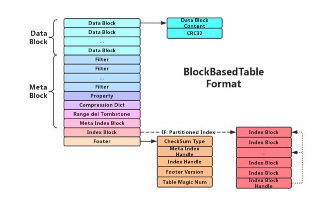

#1.SSTable

SSTable 是 RocksDB 数据在外存的存储单位。每个 SSTable 是一个单独的文 件，默认使用BlockBasedTable。
SSTable 由 Block 组成， Block 也是 RocksDB 最小的外存读取单位，包括 DataBlock, MetaBlock, IndexBlock 三种类型，

* DataBlock 记录用户的数据，
* MetaBlock 记录该 SSTable 的 BloomFilter,
* IndexBlock 记录每个 DataBlock 的范围。

每个sst文件打开是一个TableReader(BlockBasedTable)对象，它会缓存在table_cache中，这个对象里包含了meta block和index block，所以table_cache基本上也是这两个东西占用的内存。

##1.1 Meta Block
Bloom filter用于判断一个元素是不是在一个集合里，当一个元素被加入集合时，通过k个散列函数将这个元素映射成一个位数组中的k个点，把它们置为1。检索时如果这些点有任何一个为0，则被检元素一定不在；如果都是1，则被检元素很可能在。这就是布隆过滤器的基本思想。 优点：布隆过滤器存储空间和插入/查询时间都是常数O(k)。 缺点：有一定的误算率，同时标准的Bloom Filter不支持删除操作。 Bloom Filter通过极少的错误换取了存储空间的极大节省。

##1.2 Index Block
默认index block是一整块，如果使用了partitioned index，那么index block会切分成很多小块，并且建立一个二级索引，索引块在index block的最后一块

