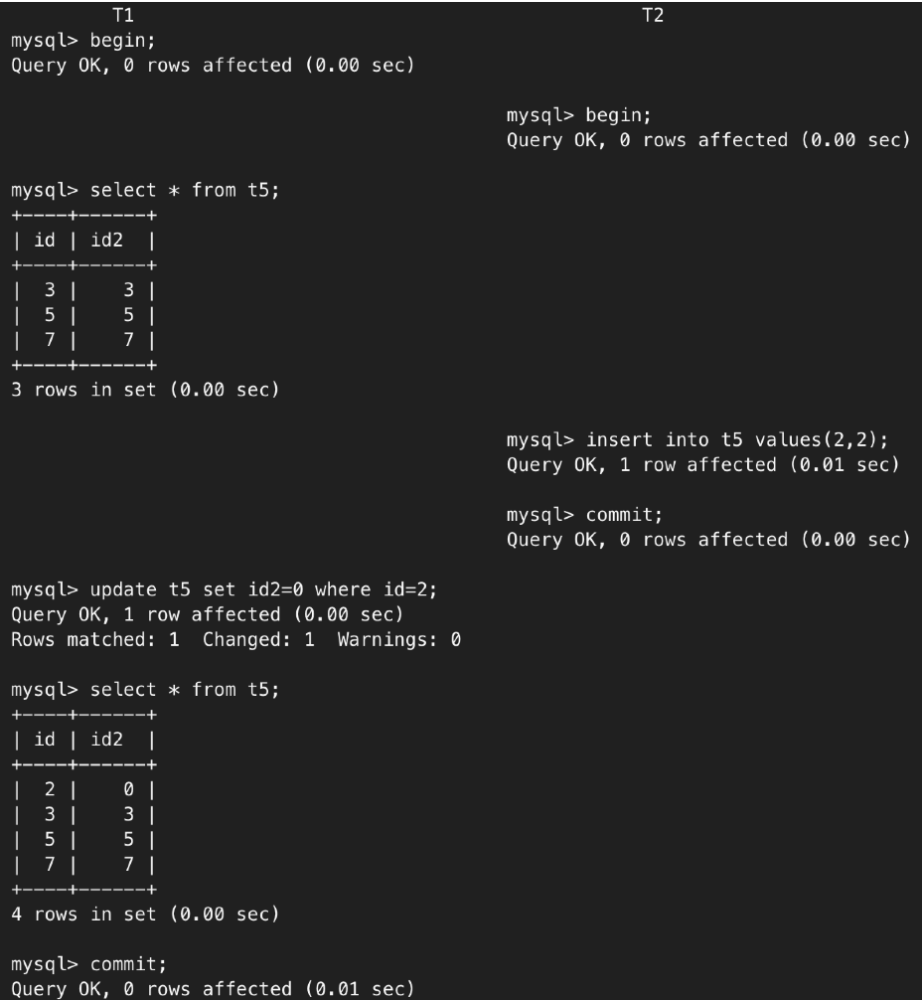
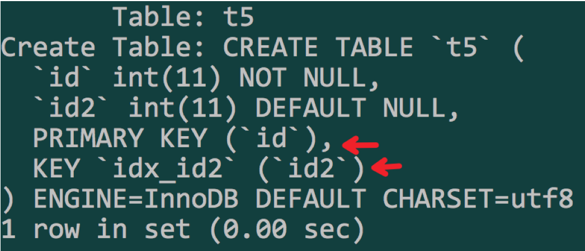
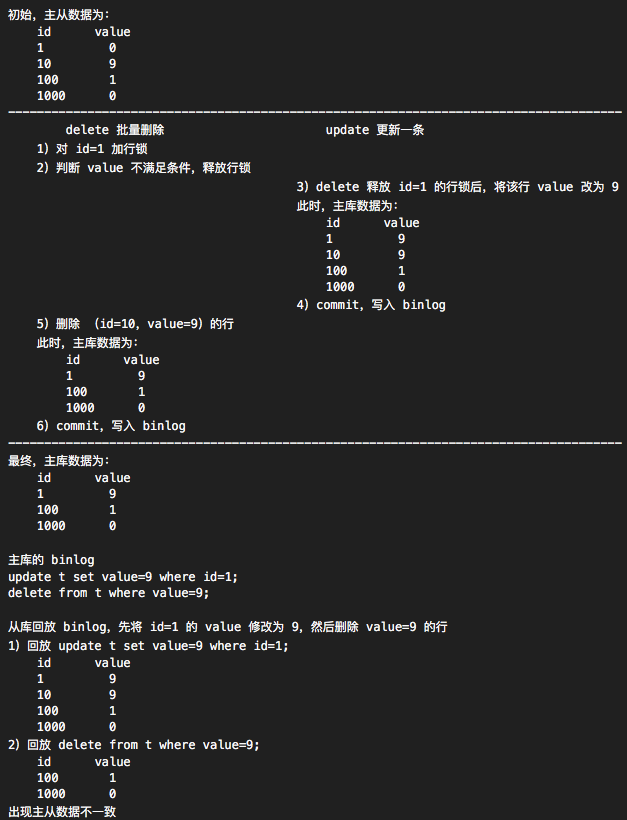
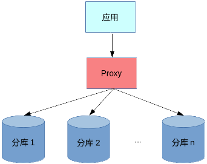

# 2 锁

## 2.1 InnoBD 中的锁

### 2.1.1 锁的类型

按照锁的粒度，可以分为 【**表锁**】 和 【**行锁**】。按照锁的类型，可以分为 【**共享锁**】和【**排它锁**】。

**表锁**：对整个表加锁。

**行锁**：对一行数据加锁。

**共享锁（S）**：可多个事务共享读取，阻止其他事务的写操作。显式加锁方式 SELECT ... LOCK IN SHARE MODE。表示对 select 语句涉及的范围添加共享锁，允许其它事务读取该范围内的数据，但不允许其它事务修改。

**排他锁（X）**：单个事务独占，阻止其他事务的排他锁和共享锁。显式加锁方式 SELECT ... FOR UPDATE。FOR UPDATE 是排它锁。

**意向锁**：提高事务加表锁时的效率，意向锁也分为【**意向共享锁**】和【意向排它锁】。

例如：在 T1 加行锁时，数据库会默认为全表添加一个意向锁。

此时，T2 若要加表锁：

1.  会先判断是否有表锁；
2.  再判断是否有意向锁。

有意向锁表示表中的某些行有锁，此时 T2 会等待行锁释放。若没有意向锁，则需要遍历整个表来判断是否有行锁，效率很低。

* * *

### 2.1.2 锁的范围

1.  **Record lock**：锁住的是索引，而非记录本身
2.  **Gap lock**：在索引记录之间的间隙中加锁，并不包括索引记录本身。
    1.  幻读针对另一个 session 的 insert 操作，不可重复读则针对于另一个 session 的 delete/update 操作。MySQL 中，默认为 RR，select 是读取不到另一个 session 的 insert 的，但是 update/delete 却能更新另一个 session 的 insert，出现了幻读，但是满足定义。
    2.  根本原因是 MySQL 的 update/delete 会生成一个新的 lsn，通过 mvcc 判断，大于另一个 session 的事务的 lsn，满足可见性要求，因此出现幻读。
    3.  gap lock 的目的是实现 RR 的隔离级别，解决不可重复读的问题。Innodb 的实现方式，一定程度上避免了幻读，但无法彻底解决。update 能够更新其他 session 的写入。  
        
3.  Next-key lock：行锁加间隙锁，即 Record lock + Gap lock  
     

具体情况见下表：





  

<table class="wrapped confluenceTable"><colgroup><col><col><col></colgroup><tbody><tr><td class="confluenceTd"><br></td><td class="confluenceTd"><p class="table-cell-line"><span style="color: rgb(51,51,51);">t4 无主键，id2 辅助索引</span></p></td><td class="confluenceTd"><p class="table-cell-line"><span style="color: rgb(51,51,51);">t5 id 为主键，id2 辅助索引</span></p></td></tr><tr><td class="confluenceTd"><p class="table-cell-line"><span style="color: rgb(51,51,51);">select for update id=5</span></p></td><td class="confluenceTd"><p class="table-cell-line"><span style="color: rgb(51,51,51);">任何位置都无法插入</span></p><p class="table-cell-line"><span style="color: rgb(51,51,51);">升级为</span><span style="color: rgb(223,64,42);">表锁</span></p></td><td class="confluenceTd"><p class="table-cell-line"><span style="color: rgb(51,51,51);">优化为 </span><span style="color: rgb(223,64,42);">record lock</span><span style="color: rgb(51,51,51);">，任何位置可以插入</span></p></td></tr><tr><td class="confluenceTd"><p class="table-cell-line"><span style="color: rgb(51,51,51);"><span>select </span>for update id2=5</span></p></td><td class="confluenceTd"><p class="table-cell-line"><span style="color: rgb(0,0,0);">id2=5 加 record lock</span></p><p class="table-cell-line"><span style="color: rgb(51,51,51);">id2=4/6 无法插入</span></p><p class="table-cell-line"><span style="color: rgb(51,51,51);">索引记录前后加 gap lock</span></p></td><td class="confluenceTd"><p class="table-cell-line"><span style="color: rgb(0,0,0);">id2=5 加 record lock</span></p><p class="table-cell-line"><span style="color: rgb(51,51,51);">id2=4/6 无法插入</span></p><p class="table-cell-line"><span style="color: rgb(51,51,51);">索引记录前后加 gap lock</span></p></td></tr></tbody></table>

  

## 2.2 RockDB 的锁

### 2.2.1 支持的锁

支持行锁中的 排它锁 select for update 和 共享锁 select lock in share mode。所有的锁信息都保存在内存中。每个 CF 都维护了一个锁的 map。

不支持 gap lock：

*   会对唯一键（包括主键、唯一索引）加排它锁，避免重复插入、插入的数据被其他事务修改。
*   但是其他事务可以随意在间隙中插入数据。

InnoDB 中写操作会加 Next-key lock，阻塞一定范围内其他事务的写操作。而 RocksDB 不支持 gap lock，则会导致下图中的问题。


*   上图的两条 SQL 可能的执行顺序如下：



  

因此，必须使用 RBR（Row Based Binary Logging），即行模式的复制，binlog 中记录的是一行数据的状态。

【**GAP Lock 缺失的问题**】

没有 gap lock，在事务并发执行时，不会阻塞写操作，因而会更容易触发死锁。

在之前的 RocksDB 中，T1更新1000W 行，当其更新到第900W 行时，T2 更新了最后100W 行，此时会产生死锁。

InnoDB 中，会申请 1000W 行的写锁，因此会阻塞其他事务更新相关的行，不会出现死锁。

### 2.2.2 加锁行为分析

*   MyRocks只会对主键和唯一索引加锁，普通索引不会加锁。
    
*   只有插入或更新了唯一索引时，才会对唯一索引加锁，对唯一索引加锁的目的是为了保证唯一性。
    
*   按主键锁定查找不存在的行时，会对不存在的行主键加X锁。
    
*   按二级索引查找时，只会对主键加锁，不会对二级锁引加锁。
    
*   S锁只应用于SELECT … IN SHARE MODE语句。
    

* * *

# 3 事务

## 3.1 通用功能

RocksDB 支持 beign / commit / rollback，不支持 savepoint。

savepoint 创建回滚点：语法 savepoint a1; 创建了名为 a1 的回滚点

## 3.2 特性限制

### 3.2.1 一致性快照

创建一致性快照的时间点，可以分为 start transaction 时创建 / 执行第一条 SQL 时创建

*   PostgreSQL：在 begin 时创建快照
*   RocksDB：在 begin 后，执行第一条语句时创建一致性快照，创建时间晚于 PG，但创建快照后的行为与 PG 相同，即 select for update、update 等操作仍然从快照中读取
*   InnoDB：在第一条语句执行时创建一致性快照，但 select for update、update 等操作会查询最新数据，而不是从快照中读取

RocksDB 中通过 sequence number 来实现 mvcc 实现。。RocksDB 的主键由 User key (string) | sequence number (7 bytes) 两部分组成，通过 sequence number 来实现 MVCC。

*   User key 为用户指定的主键，同样 User key 的记录可能有多条。
*   sequence number 是每条记录的序列号，每条记录都不相同。

### 3.2.2 MVCC

RocksDB 生成快照时，获取当前记录的 sequence number 记作 Sn，事务查询时会比对 sequence number，只能看到 S <= Sn 的记录。

### 3.2.3 隔离级别

*   InnoDB：事务中直接 select，会读取快照，select for update、update 等操作会直接读取当前的最新数据，这样会导致幻读，在ANSI 标准中，RR 可以出现幻读，因此，InnoDB 的实现没有问题
*   RocksDB：支持 RC + RR 两种隔离级别
    *   RC：每执行一条语句都会创建一个快照，保证能读取到最新提交的数据
    *   RR：begin 后执行第一条语句时创建快照，与 MySQL 创建 read view 的时机相同

### 3.2.4 XA

XA是X/Open DTP组织（X/Open DTP group）基于两阶段提交协议定义的一组中间件与数据库之间的接口规范，用来完成一个分布式事务。

X/Open DTP模型包括：应用程序（AP）、事务管理器（TM）、资源管理器（RM）、通信资源管理器（CRM）四部分。

事务管理器：由proxy 充当；

资源管理器：指的是数据库；

通信资源管理器：指的是消息中间件。



MySQL 中分为【内部 XA（隐式 XA）】 与 【外部 XA（显式 XA）】

【外部 XA】：用于实现跨 MySQL 实例的分布式事务

【内部 XA】：用于 engine & binlog、engine & engine 的两阶段提交

旧版本 RocksDB 不支持 XA，因此，在事务提交过程中无法保证 写binlog 与 commit 构成一个分布式事务，master commit 但是未写入 binlog 时发生宕机，已提交事务无法同步到备库，会导致从库的数据与主库不一致。因此，需要开启 semi-sync（半同步），即多个从库中有任何一个返回同步成功（写入 relay log）后，master 才能 commit，避免因 XA 缺失造成主从数据不一致。

### 3.2.5 RocksDB XA

新版的 RocksDB 已经支持了 XA & 2PC。请参考：[https://github.com/facebook/rocksdb/wiki/Two-Phase-Commit-Implementation](https://github.com/facebook/rocksdb/wiki/Two-Phase-Commit-Implementation)

#### 3.2.5.1 实现

之前，RocksDB 的 WriteBatch 操作的构成如下：

```java
Sequence(0);NumRecords(3);Put(a,1);Merge(a,1);Delete(a);
```

引入 XA 后，新增了四个操作：

1.  Prepare(xid)
2.  EndPrepare()
3.  Commit(xid)
4.  Rollback(xid)

支持 XA 后，分布式事务的写操作如下：

```java
Sequence(0);NumRecords(6);Prepare(foo);Put(a,b);Put(x,y);EndPrepare();Put(j,k);Commit(foo);
```

Prepare 与 EndPrepare 相当于一对括号，将 ID 为 ‘foo’ 的交易括起来，foo 就是 xid。

Commit 与 Rollback用来标识 事务 xid 的最终状态。

#### 3.2.5.2 兼容性

需要考虑向下兼容的问题，旧版本的 rocksdb 无法识别2PC 的新增操作类型，将导致无法使用 WAL 恢复数据。RocksDB 可以简单跳过 prepare 等无法识别的标记。
